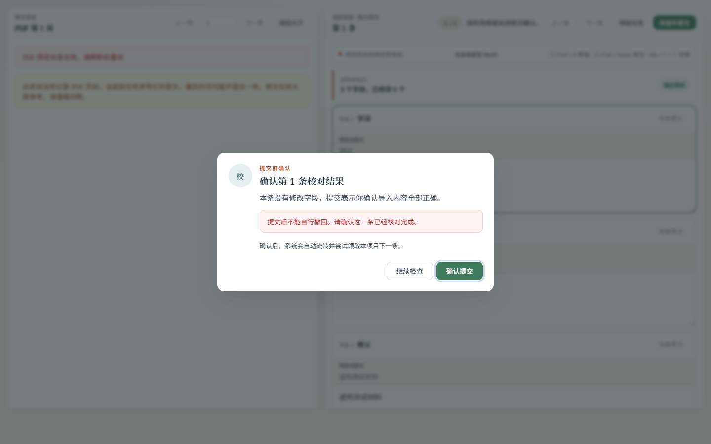
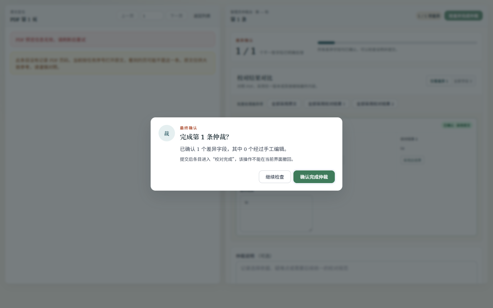

# 仲裁提交确认框键盘回归

Issue #262 的验证截图，使用真实校对/仲裁视图、虚构 API 数据和 Edge 桌面视口生成，
不包含生产账号或语料。截图中的 PDF 错误提示来自没有 PDF 的合成测试条目。

| 校对确认框 | 仲裁确认框 |
| --- | --- |
|  |  |

两条路径均由 `AppModal` 渲染，使用相同的对话框结构和样式。

仲裁操作的连续截图：

1. [打开：初始焦点在「确认完成仲裁」](arbitration-desktop-0-opened.png)。
2. [按一次 Tab：焦点循环至「继续检查」](arbitration-desktop-0-tab-first.png)。
3. [累计八次 Tab：焦点仍在对话框内](arbitration-desktop-0-tab.png)。
4. [ESC 关闭：焦点归还「检查并完成仲裁」](arbitration-desktop-0-restored.png)。

`frontend/tests/browser/modal.cjs` 同时断言桌面和手机布局、仲裁两个桌面入口、
八次 Tab 和八次 Shift+Tab、ESC/取消/遮罩关闭、背景滚动锁、关闭后焦点归还、
差异字段确认门槛，以及打开/取消确认框不发起提交。

复现命令与环境变量见 `frontend/tests/browser/README.md`。手机检查使用浏览器视口模拟。
